Code for “Foggy connections, cloudy frontiers: on the (non-)adaptation
of lexical structures”, Frontiers in Psychology
================
Matthias Urban
2023-02-13

### Overview

This document provides code to run the analyses reported in the article
“Foggy connections, cloudy frontiers: on the (non-)adaptation of lexical
structures”. Frontiers in Psychology. 14:1115832. doi:
10.3389/fpsyg.2023.1115832

### Required datasets

• DEM model in file ““ETOPO_2022_v1_30s_N90W180_bed.tif”” Available from
<https://www.ncei.noaa.gov/products/etopo-global-relief-model> (as of
Nov 25)

• IDS data in files “forms.csv” and “languages.csv”, version 4.2
Available from the CLDF dataset for IDS at:
<https://zenodo.org/record/5547908>

• South American dataset in file “cloudfog SA data and sources.tsv”
Available from the Github repository for this article at:
<https://github.com/urban-m/cloudfog>

### Required packages

``` r
library(tidyverse)
library(brms)
library(ggplot2)
library(cowplot)
library(raster)
library(ggridges)
library(ggpubr)
```

### To begin, set seed for reproducibility

``` r
set.seed(47)
```

### IDS analysis

#### Data preparation and exploration

###### Read in data

``` r
IDS_raw <- read.csv("forms.csv", header = T, encoding = "UTF-8")
IDS_languages <-read.csv("languages.csv", header = T, encoding = "UTF-8") 
```

##### Subset data to only keep relevant information, then join into a single dataset

``` r
IDS_raw <- filter(IDS_raw, Parameter_ID == "1-730" | Parameter_ID == "1-740")
IDS_languages <- IDS_languages %>% rename(Language_ID = ID) %>% dplyr::select(Language_ID:Family)
IDS_raw <-left_join(IDS_raw, IDS_languages, by = "Language_ID", keep = FALSE) %>% 
    rename(lon=Longitude, lat=Latitude) %>% filter(!is.na(lon)) 
```

##### Check if languages are Colexifying or Distinguishing with regard to ‘cloud’ and ‘fog’

``` r
colex <- list()
for (i in unique(IDS_raw$Language_ID)){
  subset <- filter(IDS_raw, Language_ID == i)
  colex[i] <- ifelse(n_distinct(subset$Form) < nrow(subset), "Colexifying", "Distinguishing")
}
colex <- unlist(colex)
```

##### Now convert to a dataset in which there is one row per language, classified for the Colexification behavior

``` r
IDS_data <- IDS_raw %>% group_by(Language_ID) %>% slice(1) %>% ungroup() %>%   
   dplyr::select(c(Glottolog_Name, Language_ID, Glottocode, Macroarea, lat, lon, Family)) %>% 
   mutate(Colex = colex)
```

##### Extract elevation from DEM, Log-transform elevation, and set Dutch to 1 masl

``` r
elevation_raster <- raster("ETOPO_2022_v1_30s_N90W180_bed.tif")
IDS_data <- mutate(IDS_data, Elevation = extract(elevation_raster, IDS_data[, c("lon", "lat")], 
  method="simple")) %>% mutate(IDS_data, LogElevation = log(Elevation))
IDS_data[74,"Elevation"] = 1
```

#### Create plots

``` r
IDS_data_violinplot <- ggplot(IDS_data, aes(x = Colex, y = Elevation))  +
 geom_violin() +
 theme_minimal() +
 ggtitle("Whole IDS sample") +
 theme(plot.title = element_text(hjust = 0, size = 12, face = "bold"), legend.title =     
     element_blank(), legend.text = element_text(size = 12)) +
 theme(axis.title = element_text(size = 12)) +
 scale_x_discrete(labels = c("", "")) +
 geom_dotplot(aes(fill = Colex), color = NA,  binaxis = 'y', stackdir = 'center', binwidth = 65,       stackratio = 0.8, dotsize=1.2) +
 xlab("") +
 ylab("Elevation (masl)")
 
IDS_data_ridgeplot <- ggplot(IDS_data %>% group_by(Family) %>% filter(n() > 2), aes(x =                Elevation, y = fct_reorder(Family, Elevation, .desc = TRUE))) +
 theme_ridges() +
 ggtitle("Ridgeplots by family") +
 theme(plot.title = element_text(hjust = -1, , size = 12, face = "bold"), legend.title =     
     element_blank(), legend.text = element_text(size = 12)) +
 theme(axis.text=element_text(size=10)) +
  geom_density_ridges(
     aes(point_color = Colex, point_fill = Colex), jittered_points = TRUE, alpha = 0.3,        
     point_alpha = 1, point_size = 1.2, scale=0.85) +
 labs (x = "Elevation (masl)", y = "") +
 scale_x_continuous(expand = c(0, 0)) +
 scale_y_discrete(expand = c(0, 0))
 
IDS_data_panel <- ggarrange(IDS_data_violinplot, IDS_data_ridgeplot, nrow = 1,  common.legend = TRUE, legend = "bottom", font.label = list(size = 12))
```

    ## Picking joint bandwidth of 133

``` r
IDS_data_panel
```

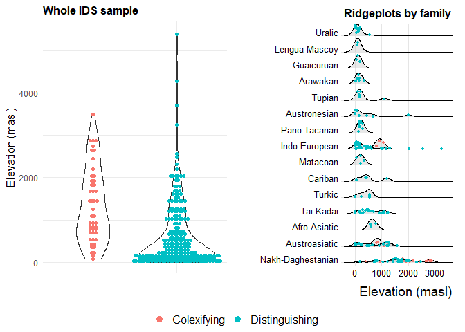<!-- -->

``` r
ggsave("IDS_data_panel.tiff", IDS_data_panel, dpi = 600)
```

    ## 

    ## Saving 7 x 5 in image

#### Bayesian Mixed Effects Modelling

##### Set priors and build model

##### check Rhat and ESS values

``` r
summary(IDS_model)
```

    ##  Family: bernoulli 
    ##   Links: mu = logit 
    ## Formula: Colex ~ LogElevation + (1 + LogElevation | Family) 
    ##    Data: IDS_data (Number of observations: 282) 
    ##   Draws: 4 chains, each with iter = 16000; warmup = 8000; thin = 1;
    ##          total post-warmup draws = 32000
    ## 
    ## Group-Level Effects: 
    ## ~Family (Number of levels: 59) 
    ##                             Estimate Est.Error l-95% CI u-95% CI Rhat Bulk_ESS
    ## sd(Intercept)                   1.42      1.04     0.07     3.93 1.00     7931
    ## sd(LogElevation)                0.30      0.23     0.01     0.88 1.00     2579
    ## cor(Intercept,LogElevation)    -0.13      0.57    -0.97     0.92 1.00     3949
    ##                             Tail_ESS
    ## sd(Intercept)                  12361
    ## sd(LogElevation)                6817
    ## cor(Intercept,LogElevation)     7510
    ## 
    ## Population-Level Effects: 
    ##              Estimate Est.Error l-95% CI u-95% CI Rhat Bulk_ESS Tail_ESS
    ## Intercept        8.12      2.04     4.66    12.70 1.00    14159    16319
    ## LogElevation    -0.92      0.30    -1.57    -0.38 1.00    18577    17930
    ## 
    ## Draws were sampled using sampling(NUTS). For each parameter, Bulk_ESS
    ## and Tail_ESS are effective sample size measures, and Rhat is the potential
    ## scale reduction factor on split chains (at convergence, Rhat = 1).

##### Inspect chains

``` r
plot(IDS_model)
```

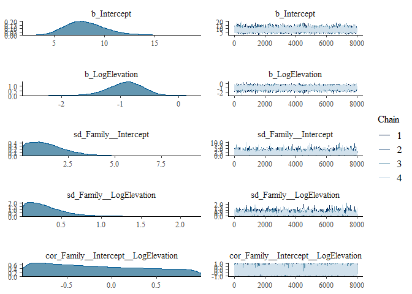<!-- -->

##### Inspect plots of observed data and posterior predictive samples

``` r
pp_check(IDS_model)
```

    ## Using 10 posterior draws for ppc type 'dens_overlay' by default.

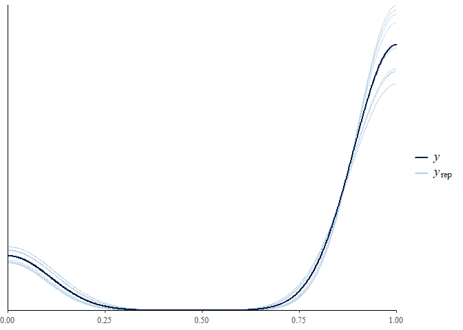<!-- -->

``` r
pp_check(IDS_model, type = "error_binned")
```

    ## Using 10 posterior draws for ppc type 'error_binned' by default.

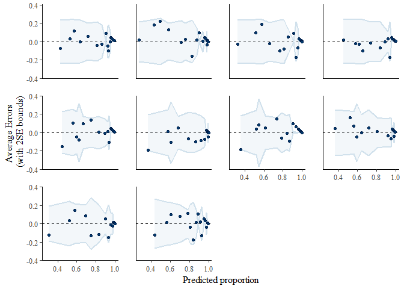<!-- -->

##### Simpler model without Elevation as Predictor

##### Compute Bayes Factor

    ## Iteration: 1
    ## Iteration: 2
    ## Iteration: 3
    ## Iteration: 4
    ## Iteration: 5
    ## Iteration: 6
    ## Iteration: 1
    ## Iteration: 2
    ## Iteration: 3
    ## Iteration: 4
    ## Iteration: 5

    ## Estimated Bayes factor in favor of IDS_model over IDS_nullmodel: 128.49077

### South American analysis

#### Data preparation and exploration

##### Read in data

``` r
SA_data <- read.csv("cloudfog SA data and sources.tsv", header = T, sep = "\t", encoding = "UTF-8")
```

##### Prepare data

``` r
SA_data <- mutate(SA_data, Colex = as.character(Colex))
SA_data <- SA_data %>% rename(lon=Longitude, lat=Latitude)
```

##### Extract elevation from DEM, Log-transform elevation

``` r
SA_data <- mutate(SA_data, Elevation = extract(elevation_raster, SA_data[, c("lon", "lat")], method="simple")) %>%  mutate(SA_data, LogElevation = log(Elevation))
```

##### Collapse families represented by only one language and isolates to one pseudo-group

``` r
SA_data <- SA_data %>% group_by(Family) %>% mutate(Family2 = n()) 
SA_data <- SA_data %>% mutate(Family2 = replace(Family2, Family2 != 1, Family)) %>%            
 mutate(Family2 = replace(Family2, Family2 == 1, "Other families and isolates"))
```

##### Reduce data to a simple distinction of Colexifying and Distinguishing languages with respect to ‘cloud’ and ‘fog’

``` r
SA_databinary <- SA_data %>% filter(Colex != "Derivation") %>% filter(Colex!= "conflicting")
SA_databinary$Family2 <- factor(SA_databinary$Family2, levels = c("Arawakan", "Aymaran", 
  "Barbacoan", "Cahuapanan", "Huitotoan", "Jivaroan", "Matacoan", "Pano-Tacanan", "Quechuan",   
  "Tucanoan", "Tupian", "Zaparoan", "Other families and isolates"))
```

##### Log-transform elevation to reduce skew

``` r
SA_data <- mutate(SA_data, LogElevation = log(Elevation))
```

##### Identify language families represented only by one language in the dataset (includes isolates) and assign these to one group

``` r
SA_data <- SA_data %>% group_by(Family) %>% mutate(Family2 = n()) 
SA_data <- SA_data %>% mutate(Family2 = replace(Family2, Family2 != 1, Family)) %>% 
    mutate(Family2 = replace(Family2, Family2 == 1, "Other families and isolates"))
```

##### Reduce coding to a binary distinction

``` r
SA_databinary <- SA_data %>% filter(Colex != "Derivation") %>% filter(Colex != "conflicting")
SA_databinary$Value <- ifelse(SA_databinary$Colex == "Colexifying", TRUE, FALSE)
```

#### Create plots

``` r
SA_data_violinplot <- ggplot(SA_databinary, aes(x = Colex, y = Elevation))  +
  geom_violin() +
  theme_minimal() +
  ggtitle("Whole South American sample") +
  theme(plot.title = element_text(hjust = 0, size = 12, face = "bold"), legend.title =      
  element_blank(), legend.text = element_text(size = 12)) +
  theme(axis.title = element_text(size = 12)) +
  scale_x_discrete(labels = c("", "")) +
  geom_dotplot(aes(fill = Colex), color = NA,  binaxis = 'y', stackdir = 'center', binwidth = 65,       stackratio = 0.8, dotsize=1.2) +
  xlab("") +
  ylab("Elevation (masl)")
SA_data_violinplot 
```

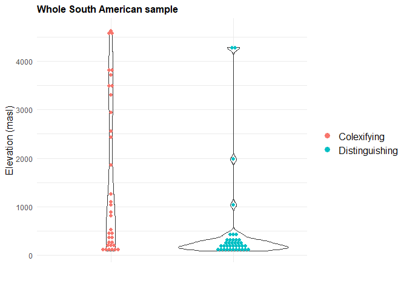<!-- -->

``` r
SA_data_ridgeplot <- ggplot(SA_databinary %>% group_by(Family) %>% filter(n() > 2), 
  aes(x = Elevation, y = fct_reorder(Family, Elevation, .desc = TRUE))) +
  theme_ridges() +
  ggtitle("Ridgeplots by family") +
  theme(plot.title = element_text(hjust = 0, size = 12), legend.title = element_blank(), legend.text =   
      element_text(size = 12)) +
  theme(axis.text=element_text(size=10)) +
  geom_density_ridges(
  aes(point_color = Colex, point_fill = Colex), jittered_points = TRUE, alpha = 0.3, point_alpha 
     = 1, point_size = 1.3, scale=0.85) +
  geom_point(data = subset(SA_databinary, Family == "Aymaran"), aes(x = Elevation), position =   
  position_nudge(y = 0.2), size = 1.2, color = "#00BFC4") +
  labs (x = "Elevation (masl)", y = "") +
  scale_x_continuous(expand = c(0, 0)) +
  scale_y_discrete(expand = c(0, 0))
SA_data_ridgeplot
```

    ## Picking joint bandwidth of 178

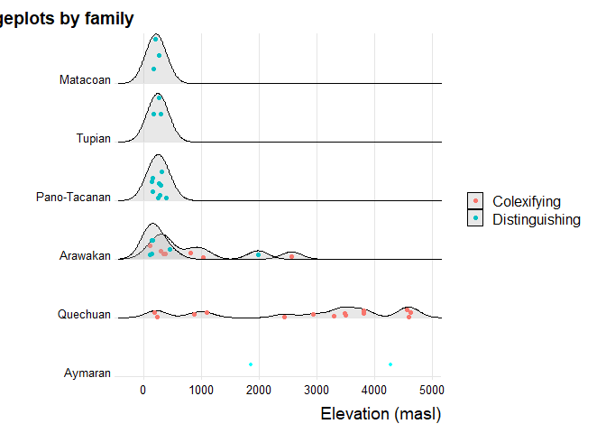<!-- -->

``` r
SA_data_panel <- ggarrange(SA_data_violinplot, SA_data_ridgeplot, nrow = 1,  common.legend = TRUE, legend = "bottom", font.label = list(size = 12))
```

    ## Picking joint bandwidth of 178

``` r
SA_data_panel
```

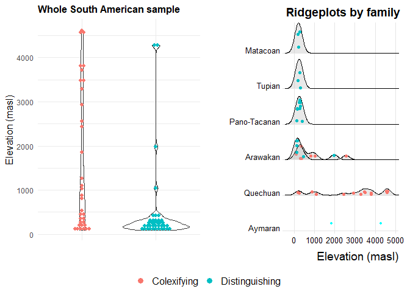<!-- -->

``` r
ggsave("SA_data_panel.tiff", SA_data_panel, dpi = 600)
```

    ## 

    ## Saving 7 x 5 in image

#### Bayesian Mixed Effects Modelling

###### Set priors and build model

##### check Rhat and ESS values

``` r
summary(SA_databinarymodel)
```

    ##  Family: bernoulli 
    ##   Links: mu = logit 
    ## Formula: Colex ~ LogElevation + (1 + LogElevation | Family2) 
    ##    Data: SA_databinary (Number of observations: 72) 
    ##   Draws: 4 chains, each with iter = 12000; warmup = 8000; thin = 1;
    ##          total post-warmup draws = 16000
    ## 
    ## Group-Level Effects: 
    ## ~Family2 (Number of levels: 14) 
    ##                             Estimate Est.Error l-95% CI u-95% CI Rhat Bulk_ESS
    ## sd(Intercept)                   1.93      1.52     0.07     5.68 1.00     4634
    ## sd(LogElevation)                0.51      0.38     0.02     1.44 1.00     2243
    ## cor(Intercept,LogElevation)    -0.10      0.58    -0.96     0.94 1.00     2760
    ##                             Tail_ESS
    ## sd(Intercept)                   6122
    ## sd(LogElevation)                4542
    ## cor(Intercept,LogElevation)     4974
    ## 
    ## Population-Level Effects: 
    ##              Estimate Est.Error l-95% CI u-95% CI Rhat Bulk_ESS Tail_ESS
    ## Intercept        3.73      2.78    -1.65     9.45 1.00    16700    12266
    ## LogElevation    -0.64      0.48    -1.63     0.26 1.00    13888    10886
    ## 
    ## Draws were sampled using sampling(NUTS). For each parameter, Bulk_ESS
    ## and Tail_ESS are effective sample size measures, and Rhat is the potential
    ## scale reduction factor on split chains (at convergence, Rhat = 1).

##### Inspect chains

``` r
plot(SA_databinarymodel)
```

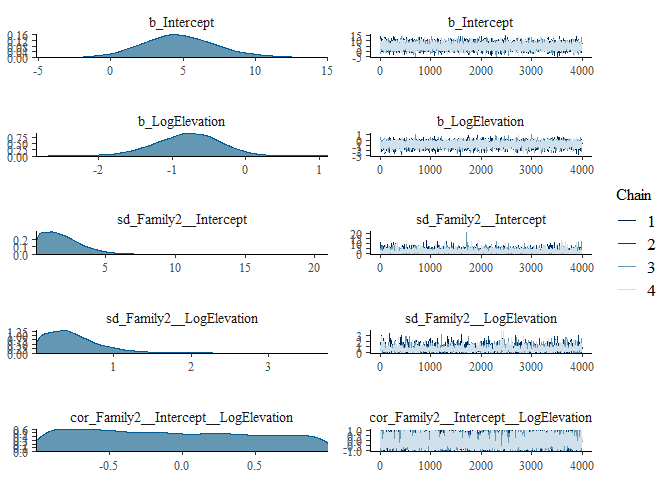<!-- -->

##### Inspect plots of observed data and posterior predictive samples

``` r
pp_check(SA_databinarymodel)
```

    ## Using 10 posterior draws for ppc type 'dens_overlay' by default.

<!-- -->

``` r
pp_check(SA_databinarymodel, type = "error_binned")
```

    ## Using 10 posterior draws for ppc type 'error_binned' by default.

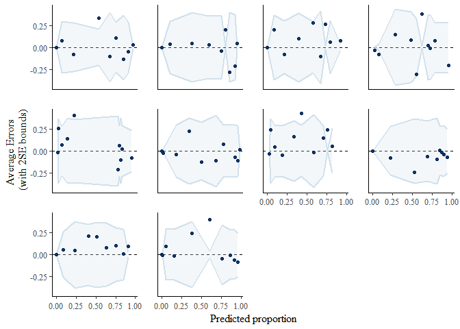<!-- -->

##### Simpler model without Elevation as Predictor

##### Compute Bayes Factor

    ## Iteration: 1
    ## Iteration: 2
    ## Iteration: 3
    ## Iteration: 4
    ## Iteration: 5
    ## Iteration: 6
    ## Iteration: 7
    ## Iteration: 8
    ## Iteration: 1
    ## Iteration: 2
    ## Iteration: 3
    ## Iteration: 4
    ## Iteration: 5

    ## Estimated Bayes factor in favor of SA_databinarymodel over SA_databinarynnullmodel: 0.85641

#### Alternative model without isolates and singleton representatives of families collapsed

##### check Rhat and ESS values

``` r
summary(SA_databinarymodelalt)
```

    ##  Family: bernoulli 
    ##   Links: mu = logit 
    ## Formula: Colex ~ LogElevation + (1 + LogElevation | Family) 
    ##    Data: SA_databinary (Number of observations: 72) 
    ##   Draws: 4 chains, each with iter = 16000; warmup = 8000; thin = 1;
    ##          total post-warmup draws = 32000
    ## 
    ## Group-Level Effects: 
    ## ~Family (Number of levels: 26) 
    ##                             Estimate Est.Error l-95% CI u-95% CI Rhat Bulk_ESS
    ## sd(Intercept)                   1.97      1.60     0.08     5.85 1.00     8511
    ## sd(LogElevation)                0.55      0.43     0.03     1.61 1.00     2977
    ## cor(Intercept,LogElevation)    -0.10      0.58    -0.96     0.94 1.00     3174
    ##                             Tail_ESS
    ## sd(Intercept)                  11951
    ## sd(LogElevation)                6722
    ## cor(Intercept,LogElevation)     7690
    ## 
    ## Population-Level Effects: 
    ##              Estimate Est.Error l-95% CI u-95% CI Rhat Bulk_ESS Tail_ESS
    ## Intercept        5.24      2.92    -0.26    11.35 1.00    23943    21559
    ## LogElevation    -0.73      0.52    -1.79     0.27 1.00    19219    18974
    ## 
    ## Draws were sampled using sampling(NUTS). For each parameter, Bulk_ESS
    ## and Tail_ESS are effective sample size measures, and Rhat is the potential
    ## scale reduction factor on split chains (at convergence, Rhat = 1).

##### Inspect chains

``` r
plot(SA_databinarymodelalt)
```

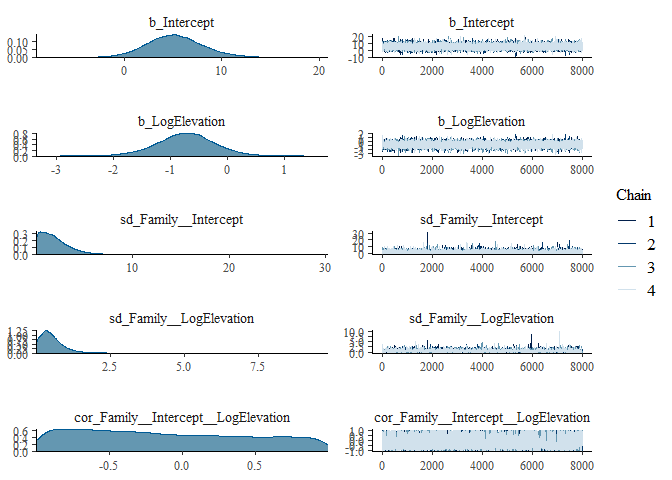<!-- -->

##### Inspect plots of observed data and posterior predictive samples

``` r
pp_check(SA_databinarymodelalt)
```

    ## Using 10 posterior draws for ppc type 'dens_overlay' by default.

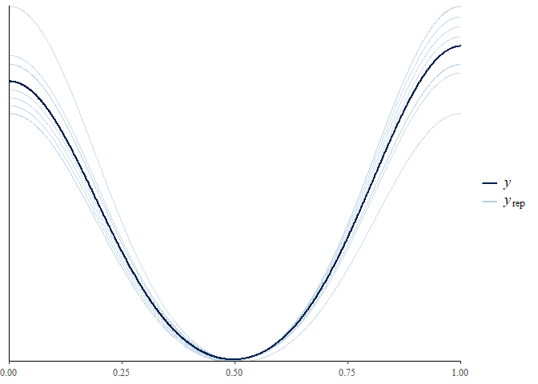<!-- -->

``` r
pp_check(SA_databinarymodelalt, type = "error_binned")
```

    ## Using 10 posterior draws for ppc type 'error_binned' by default.

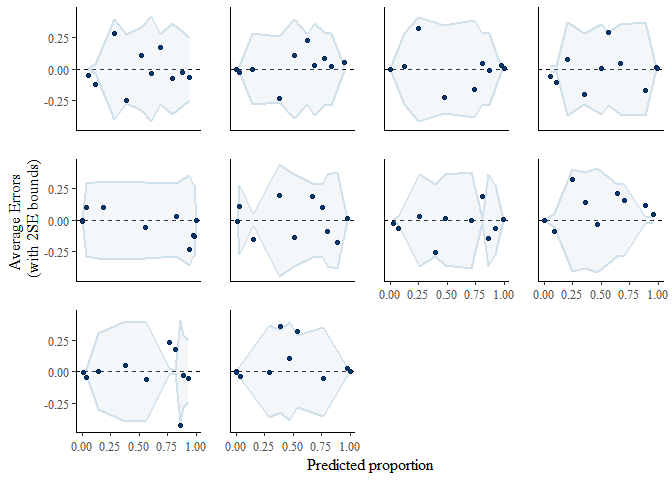<!-- -->

#### Resampling and randomization test

##### Duplicate dataset and shuffle colexification values

``` r
SA_databinary_shuffle<-SA_databinary
SA_databinary_shuffle$Value <- sample(SA_databinary_shuffle$Value, size = nrow(SA_databinary), replace = FALSE)
```

##### Procedure for resampling. This function adapted from Moran, Steven, Nicholas A. Lester and Eitan Grossman. 2021. Inferring recent evolutionary changes in speech sounds. Philosophical Transactions of the Royal Society B, 376. 20200198. <https://doi.org/10.1098/rstb.2020.0198>.

``` r
resampling_withinFamilies =
  
  function(df){
    langs = vector()
    for(family_ID in unique(df$Family)){
      lang =
        sample(df$Name[df$Family == family_ID], 1)
      langs = c(langs, lang)
    }
    
    curr_sample = df[df$Name %in%
                       langs,]
    return(curr_sample)
  }
```

##### Resample. This is adapted from code by James S. Santangelo available at <https://uoftcoders.github.io/rcourse/lec12-randomization-tests.html>

``` r
sim_means <- list()
resample_means <- list()

for(i in 1:10000){
  SA_databinary_resample<-resampling_withinFamilies(SA_databinary)
  SA_databinary_sim<-SA_databinary_resample
  SA_databinary_sim$Value <- sample(SA_databinary_sim$Value, size = nrow(SA_databinary_sim), 
      replace = FALSE)
  mean_identical_resample <- mean(SA_databinary_resample %>% filter(Value == TRUE) %>% 
     pull(Elevation))
  mean_distinct_resample <- mean(SA_databinary_resample %>% filter(Value == FALSE) %>%   
     pull(Elevation))
  mean_identical_sim <- mean(SA_databinary_sim %>% filter(Value == TRUE) %>% pull(Elevation))
  mean_distinct_sim <- mean(SA_databinary_sim %>% filter(Value == FALSE)  %>% pull(Elevation))
  mean_diff_resample <- mean_identical_resample - mean_distinct_resample
  mean_diff_sim <- mean_identical_sim - mean_distinct_sim
  resample_means[i] <- mean_diff_resample
  sim_means[i] <- mean_diff_sim
}
sim_means<-unlist(sim_means)
resample_means<-unlist(resample_means)
```

##### Plot results

``` r
resampling_ggplot<- ggplot() +
  geom_histogram(aes(sim_means), fill ="cyan", binwidth = 20, color = "gray", alpha = 0.3) +
  geom_histogram(aes(resample_means), fill = "red", , binwidth = 20, color = "gray", alpha = 0.3) +
  xlab("Difference in mean elevation of colexifying and distinguishing languages. Simulated data in cyan, observed data in red") +
  ylab("Number of observations") +
  theme_minimal()

resampling_ggplot
```

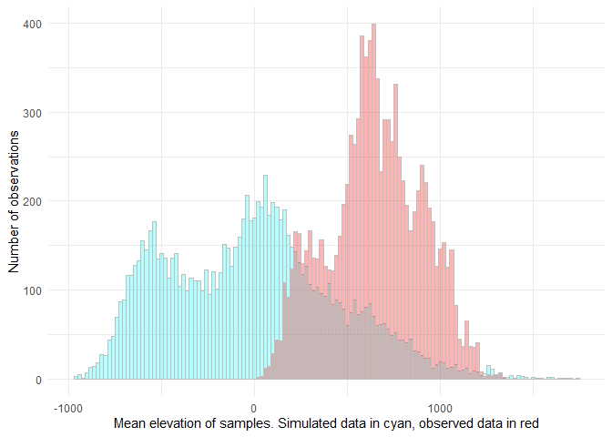<!-- -->

``` r
save_plot("resampling_boxplot.tiff", resampling_ggplot, base_width = 10, base_height = 6, dpi = 300)
```

##### Test for significance by the good old t-test.

``` r
t.test(sim_means, resample_means)
```

    ## 
    ##  Welch Two Sample t-test
    ## 
    ## data:  sim_means and resample_means
    ## t = -125.6, df = 15494, p-value < 2.2e-16
    ## alternative hypothesis: true difference in means is not equal to 0
    ## 95 percent confidence interval:
    ##  -666.4152 -645.9345
    ## sample estimates:
    ##  mean of x  mean of y 
    ##  -9.270451 646.904390

#### Generalized Linear Modelling for Arawakan

##### Filter data

``` r
arawakan <- filter(SA_databinary, Family == 'Arawakan')
```

##### Build model

``` r
arawakanmodel <- glm(Value ~ LogElevation, family = 'binomial', data = arawakan) 
```

##### Check results

``` r
summary(arawakanmodel)
```

    ## 
    ## Call:
    ## glm(formula = Value ~ LogElevation, family = "binomial", data = arawakan)
    ## 
    ## Deviance Residuals: 
    ##     Min       1Q   Median       3Q      Max  
    ## -1.7677  -0.9824   0.6340   1.0961   1.4779  
    ## 
    ## Coefficients:
    ##              Estimate Std. Error z value Pr(>|z|)
    ## (Intercept)   -3.8574     3.6034  -1.070    0.284
    ## LogElevation   0.6831     0.6116   1.117    0.264
    ## 
    ## (Dispersion parameter for binomial family taken to be 1)
    ## 
    ##     Null deviance: 17.945  on 12  degrees of freedom
    ## Residual deviance: 16.530  on 11  degrees of freedom
    ## AIC: 20.53
    ## 
    ## Number of Fisher Scoring iterations: 4

##### Assess model visually

``` r
plot(arawakanmodel)
```

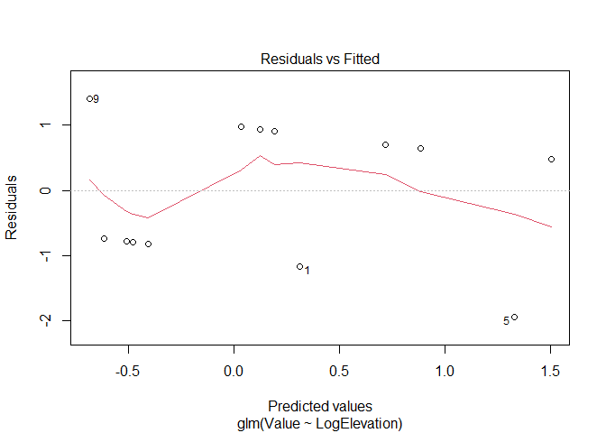<!-- -->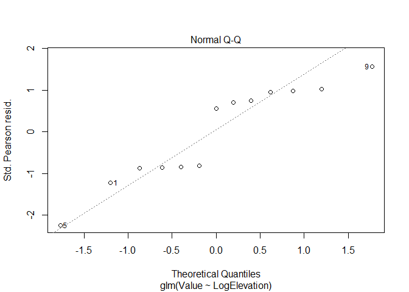<!-- -->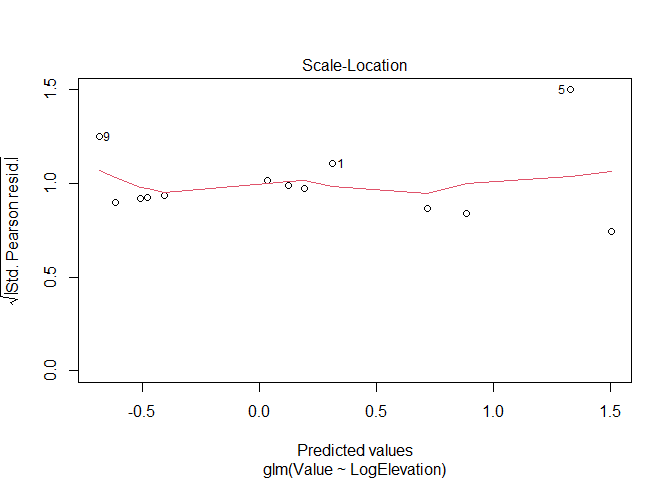<!-- -->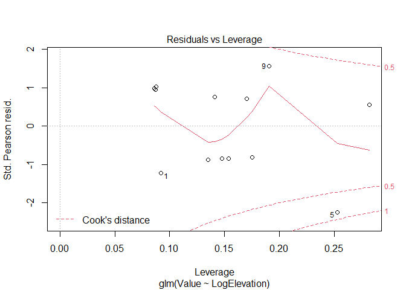<!-- -->

##### Check overdispersion…not great but ok.

``` r
pchisq(arawakanmodel$deviance, df=arawakanmodel$df.residual, lower.tail=FALSE)
```

    ## [1] 0.1225697
